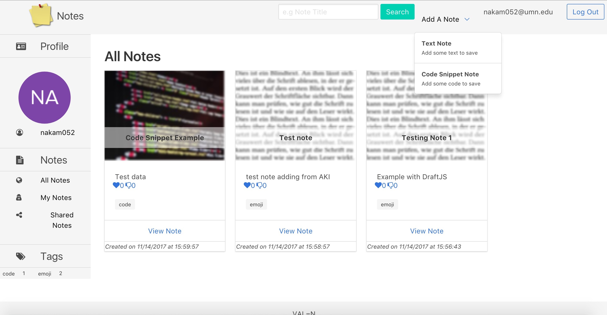
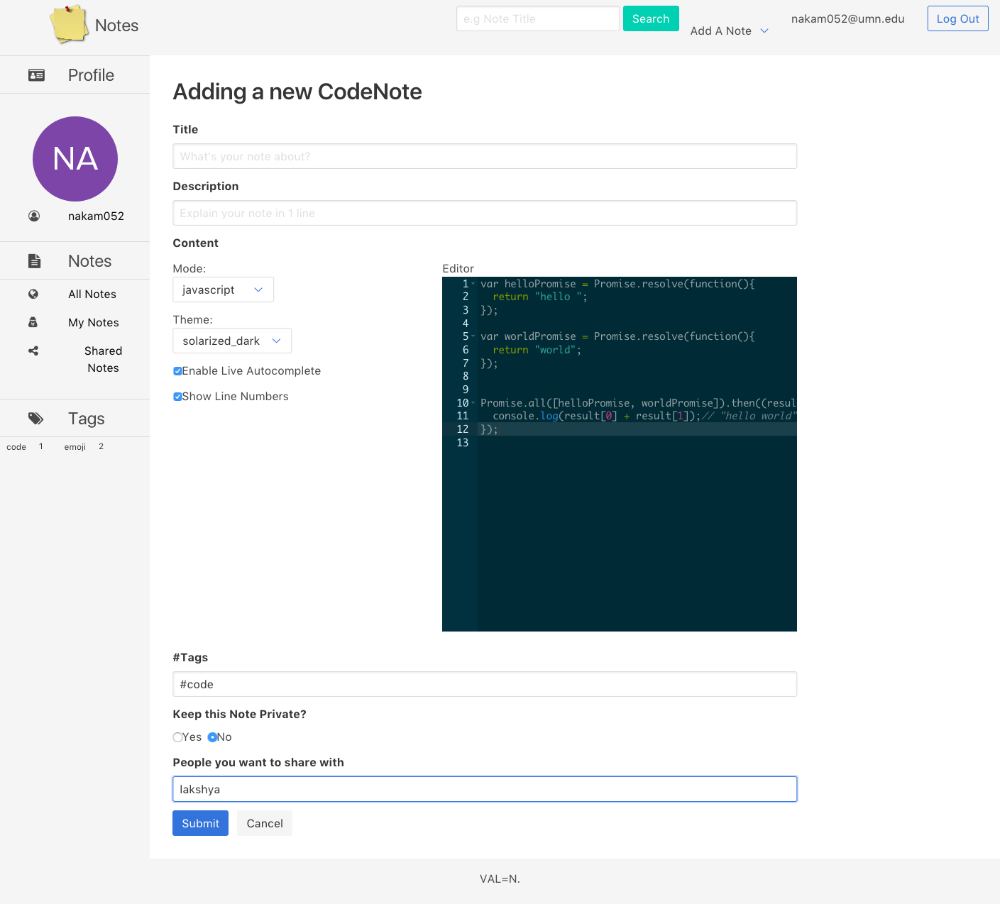

# Module 3 Group Assignment: Note-a-matic

CSCI 5117, Fall 2017, [assignment description](https://docs.google.com/document/d/13q79EywC9TzWts9K-10b_tKA-ZVyv9_avWGJpgprA6A)

## App Info:

* Team Name: val=n
* App Name: Notes
* App Link: <https://pacific-sierra-76882.herokuapp.com/>

### Students

* Lakshya Goel, goel0072@umn.edu
* Nishka Monteiro, monte299@umn.edu
* Akifumi Nakamachi, nakam052@umn.edu
* Vaybhav Shaw, shaw0162@umn.edu

## Key Features

* Allows to write and save text and code notes.
* You can write Code snippets.
* Text Editor allows creating lists with formatting and emoticons using search. 
* Code Editor provides live Auto Complete suggestions and support for a number of languages.
* Notes can be shared with the other users of the App.
* Search can be done based on the Title.
* Filtering can be done based on tags.

## Screenshots of Site

**[Add a screenshot of each key page (maximum 4)](https://stackoverflow.com/questions/10189356/how-to-add-screenshot-to-readmes-in-github-repository)
along with a very brief caption:**

## External Dependencies

* react: To render the client
* react-router-dom: To enable routing in the App
* AceEditor: To show code editing functionality
* DraftJS: Text editor with plugins for Emoji and Text Formatting
* multer: sending data from client to sever
* request: controlling http?. Maybe default to express. But to prevent plagiarism, I write that
* express-hbs: we use express-hbs instead of hbs to customize hbs functionality(e.g. partial, helper)
* mongoDB: To store the data
* mongooseJS: To develop schemas for mongoDB
* auth0: Authentication library for User Sign Up and Sign In
* passport: Authentication middleware for node
